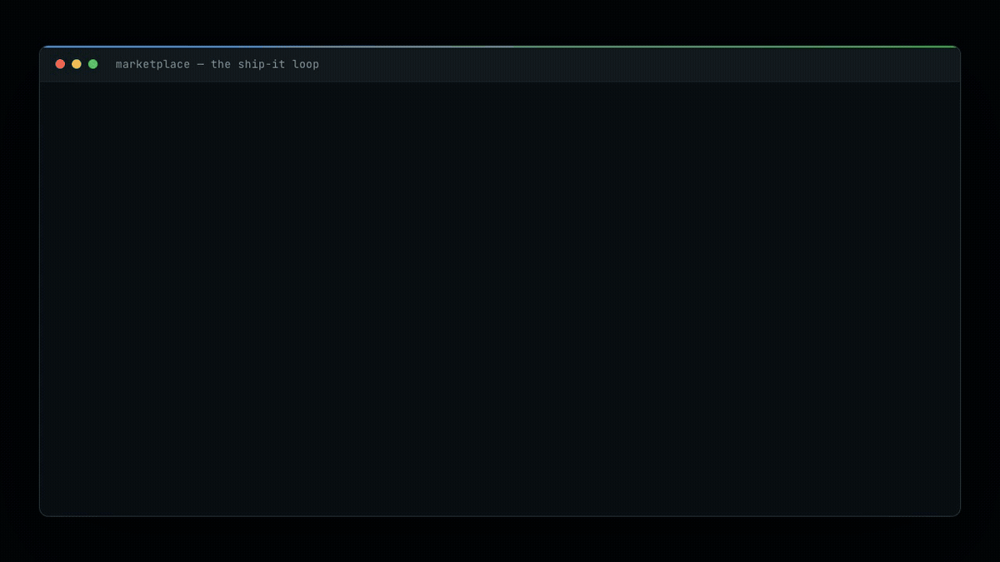

# marketplace

**Skills for [Claude Code](https://claude.com/claude-code) that ship code, not just suggest it** — scaffold an app, get a browser-verified and AI-reviewed PR open, triage feedback, cut a branded release, and round-trip client comments. Sean's personal, actively-developed plugin marketplace.

<p align="center">
  
</p>

<p align="center"><sub><em>The ship-it loop, one slash command per step. Illustrative walkthrough of real skills.</em></sub></p>


## Install

```
/plugin marketplace add SeanningTatum/marketplace
/plugin install engineering-toolkit@sean-skills
/plugin install marketing-toolkit@sean-skills
```

## Plugins

| Plugin | What you get |
| --- | --- |
| [`engineering-toolkit`](./plugins/engineering-toolkit/README.md) | The ship-it loop, end to end — scaffold, verify, review, resolve, release. |
| [`marketing-toolkit`](./plugins/marketing-toolkit/README.md) | The last-mile polish — make what you shipped legible and marketable. |

## Skills at a glance

Every skill has a README with its **what / why / how** and a visual of the output:

| Skill | Why you'd reach for it |
| --- | --- |
| [`new-app`](./plugins/engineering-toolkit/skills/new-app/README.md) | New SaaS app, live repo to cloned wizard, in one command instead of an afternoon of setup. |
| [`create-pr-with-review`](./plugins/engineering-toolkit/skills/create-pr-with-review/README.md) | Open PRs that are already proven to work and already reviewed — reviewers see a second draft, not a first one. |
| [`resolve-comments`](./plugins/engineering-toolkit/skills/resolve-comments/README.md) | Clear the easy 80% of review comments automatically; the risky 20% still needs you. |
| [`pr-format`](./plugins/engineering-toolkit/skills/pr-format/README.md) | A PR description a reviewer trusts on the first read, every time. |
| [`release`](./plugins/engineering-toolkit/skills/release/README.md) | Ship notes that read like a launch, not a changelog nobody opens. |
| [`client-review`](./plugins/engineering-toolkit/skills/client-review/README.md) | Let a non-technical client comment on your doc without a server, an account, or a login. |
| [`readme-marketing-rewrite`](./plugins/marketing-toolkit/skills/readme-marketing-rewrite/README.md) | Rewrite a whole README in plain, marketing-grade language with real screenshots of every surface, PR'd through review. |
| [`mockup-screenshot`](./plugins/marketing-toolkit/skills/mockup-screenshot/README.md) | Give a README a visual even when there's no live demo to screenshot. |

## What the output looks like

Every skill ships a README with a visual of what it produces. A few of the surfaces:

<p align="center">
  <a href="./plugins/engineering-toolkit/skills/create-pr-with-review/README.md"></a>
  <a href="./plugins/engineering-toolkit/skills/release/README.md"></a>
  <a href="./plugins/engineering-toolkit/skills/client-review/README.md"></a>
</p>

<p align="center"><sub><em>Example outputs — <code>create-pr-with-review</code>, <code>release</code>, <code>client-review</code>. Each skill's README has its own.</em></sub></p>

## Develop

```bash
claude plugin validate .                          # validate the catalog
claude --plugin-dir ./plugins/engineering-toolkit # test a plugin locally
```

See [CLAUDE.md](./CLAUDE.md) for repository structure and conventions.
