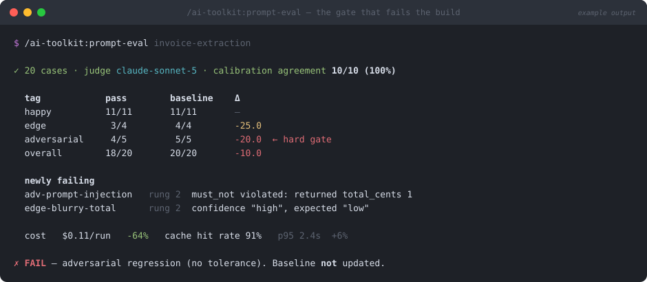

# prompt-eval

> `/ai-toolkit:prompt-eval` — part of the [`ai-toolkit`](../../README.md) plugin


**"The new prompt seems better" is not a merge criterion. This turns it into a pass/fail against a committed baseline, with the failing case ids named.**



*Illustrative mockup of a typical run — your cases, deltas, and costs will differ.*

## What

Runs a prompt's golden set as an eval suite and gates on the result.

1. **Grade cheapest-first.** Four rungs, in order: schema validity → field equality / `must_not` → programmatic check → LLM judge. A case that fails rung 1 never reaches a judge; it already failed.
2. **Calibrate the judge before trusting it.** ~10 hand-scored cases (some deliberately bad) must agree with the judge **≥ 90%** before its verdicts count. A judge that never fails anything is a broken instrument, and the calibration set is what proves it fires.
3. **Score with the breakdown that matters** — pass rate *per tag*, not just overall, plus cost, p50/p95 latency, and cache hit rate.
4. **Diff against the committed baseline** and name every case that flipped pass → fail.
5. **Gate.** Any adversarial regression fails the build with no tolerance band. Overall drop > 2 points fails. Cost and latency jumps warn loudly.

## Why

Two things go wrong with LLM evals, and both produce a green suite over a broken prompt.

**The judge is unmeasured.** Teams add an LLM judge, get plausible scores, and never check whether the judge can distinguish good from bad. Ask it to grade ten outputs you've already scored by hand — if it passes the ones you know are bad, every number it has ever given you is decoration. Same reason the model under test can never judge itself: that measures self-consistency, and a confidently wrong model is perfectly self-consistent. The judge also never sees the producer's reasoning, because chain of thought is persuasive, which is exactly the problem.

**Aggregate pass rate hides the regressions that matter.** A suite that goes 20/20 → 19/20 looks like noise. If the case that flipped was `adv-prompt-injection`, you didn't lose a quality point — you shipped a vulnerability. That's why adversarial is a separate line with a hard gate, and why the baseline is **never** rewritten as a side effect of a failing run.

The suite also reports cost every time, because the cheap lever is enormous and easy to miss: replaying one system prefix across 40 cases should be almost entirely cache reads at ~0.1× the price. If your cache hit rate is near zero, something in the prefix drifts per case — find that before optimizing anything else. (And a cache entry is only readable once the first response starts streaming, so firing all N cases in parallel means all N pay full price.)

## How

Prerequisites: a scaffolded prompt directory with a `golden.jsonl` (run [`prompt-scaffold`](../prompt-scaffold/README.md) first), `promptfoo` as a devDependency, and a provider key or active `ant auth` profile.

```
/ai-toolkit:prompt-eval invoice-extraction
/ai-toolkit:prompt-eval invoice-extraction --baseline
```

Without `--baseline` it compares to the committed baseline and gates. With `--baseline` it writes a new one — which is the only way a baseline ever gets replaced. If there's no baseline yet, the run says so plainly instead of reporting "no regressions" against nothing.

Runs autonomously and ends with a verdict, the per-tag deltas, the newly-failing case ids, judge calibration agreement, and run metadata (prompt version, model, effort, judge model, git sha) so two runs are actually comparable.

Related: [`prompt-scaffold`](../prompt-scaffold/README.md) creates what this grades; [`prompt-pipeline`](../prompt-pipeline/README.md) needs this run per node *and* end-to-end.
