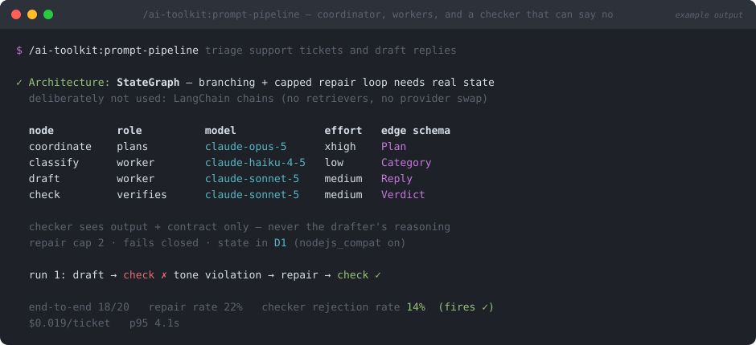

# prompt-pipeline

> `/ai-toolkit:prompt-pipeline` — part of the [`ai-toolkit`](../../README.md) plugin


**Multi-step LLM work fails at the seams, not in the prompts. This builds the seams: a schema on every edge, and a checker that is actually allowed to say no.**



*Illustrative mockup of a typical run — your nodes, models, and metrics will differ.*

## What

Designs a multi-step pipeline with three explicit roles and a bounded repair loop.

- **Architecture first, framework second.** One call → a prompt. 2–4 fixed steps → typed step functions and plain `await`; the code *is* the diagram. Branching, retries, resumable state, or a human approval gate → **LangGraph** (`StateGraph` + typed state + checkpointing), which is the part worth importing. Open-ended tool use → the provider's own agent loop. The choice and the reason get stated in one line.
- **Coordinator** — plans and routes, never does bulk work. High tier, high effort, and it emits a **plan as a schema**, not prose.
- **Workers** — one narrow job each, cheap tier, own output schema, own golden set. They never read each other's reasoning; they pass data.
- **Checker** — a *different model instance* that sees the output and the contract only, and returns `{ pass, violations, severity }`. Its golden set contains a known-bad case, so you can prove it fires.
- **Repair loop, capped at 2 and failing closed** — violations are fed back, and exhausting the budget surfaces the failure rather than returning the last rejected draft as a pass.

Plus the runtime details that bite on edge platforms: `nodejs_compat` for LangGraph on Workers, checkpointing in D1/KV/Durable Objects rather than an in-memory saver that dies with the isolate, and long coordinator runs moved off the request path into a queue.

## Why

The default failure is reaching for a chain library on step one. It adds a translation layer between you and the API, and it's the main reason multi-step LLM code is hard to debug — so this skill names what it *didn't* use, and why, as part of the design.

The subtler failure is the rubber-stamp checker. Adding a "verify this output" step feels like rigor, but three things quietly neuter it:

- **Same model reviewing itself.** Self-review measures self-consistency, not correctness.
- **Showing the checker the producer's chain of thought.** Reasoning is persuasive; a checker that reads it gets talked into plausible-sounding wrong answers.
- **Never testing that it can reject.** A checker with a 0% rejection rate isn't validating anything, and you won't find out until the run where it mattered. Hence the known-bad case in its golden set and a reported rejection rate.

An uncapped repair loop is the third trap — it turns a bad contract into unbounded spend. Two rounds of explicit feedback is the budget; if that doesn't fix it, the prompt or the contract is wrong, and more attempts just re-buy the same mistake. The **repair rate** and **checker rejection rate** are the pipeline's health metrics: one climbing toward the cap, or the other sitting at zero, means something broke quietly.

## How

Prerequisites: none beyond a repo and a provider key. LangGraph is installed only if the architecture decision actually calls for it.

```
/ai-toolkit:prompt-pipeline triage support tickets and draft replies
/ai-toolkit:prompt-pipeline extract contract terms, then verify each against the source
```

You'll see the architecture choice before code gets written — that's the decision worth reviewing. Each node is then scaffolded with [`prompt-scaffold`](../prompt-scaffold/README.md) and gated with [`prompt-eval`](../prompt-eval/README.md), and a separate end-to-end suite covers the seams that per-node evals can't see: a coordinator routing to the wrong worker, a schema mismatch, a checker passing everything.

Ends with the pinned model and effort per node, the edge schemas, the repair cap, where state lives, the eval commands, and the cost and p95 latency of one full run.
