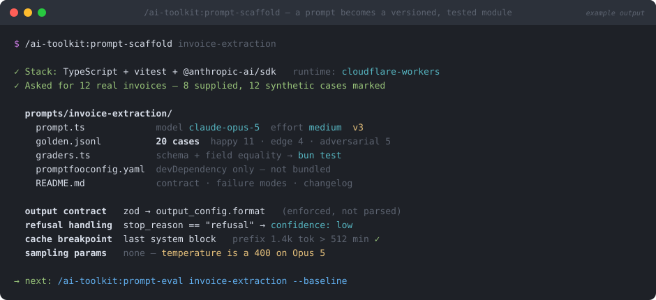

# prompt-scaffold

> `/ai-toolkit:prompt-scaffold` — part of the [`ai-toolkit`](../../README.md) plugin


**Six months from now, someone will change this prompt. The only thing standing between that edit and a silent production regression is a golden set that already existed.**



*Illustrative mockup of a typical run — your fields, counts, and file paths will differ.*

## What

Turns "write me a prompt" into a directory that ships like code:

| File | What it is |
| --- | --- |
| `prompt.ts` | The module — a **pinned model id**, a fixed `effort`, a stable system prefix, and a zod output schema. Behavior lives in one versioned file. |
| `golden.jsonl` | 20+ **hand-labeled** cases across three mandatory buckets: happy, edge, adversarial (min 5). One JSON object per line, so a diff shows exactly which case moved. |
| `graders.ts` | Deterministic assertions that ride your existing test runner — `bun test` / `vitest` covers the prompt with no second CI system. |
| `promptfooconfig.yaml` | The eval config. A devDependency; never enters your runtime bundle. |
| `README.md` | The contract, known failure modes with the case id covering each, and a version changelog. |

The output contract is **enforced by the provider** (`output_config.format` with a zod or JSON schema), not recovered by parsing prose. A safety refusal — HTTP 200 with `stop_reason: "refusal"` — is handled as its own modeled outcome rather than a crash.

## Why

Most "prompt engineering" ends at a string in a chat window, so the prompt becomes the one part of the system with no version, no contract, and no tests. Then someone tightens a sentence, the output shape shifts, and nothing catches it until a customer does.

This scaffold removes three specific failure modes:

- **The unversioned model swap.** Changing `claude-sonnet-5` → `claude-opus-5` changes outputs, invalidates the prompt cache, and voids your baseline. Pinning the model *in the module* makes it a version bump with a required re-baseline, not a config tweak someone does on a Friday.
- **The self-graded golden set.** If the model under test writes its own expected outputs, your suite measures self-consistency and will happily certify a confidently wrong prompt. Labels are human here, and synthetic cases are marked as synthetic.
- **The `temperature: 0` reflex.** Sampling parameters are **rejected with a 400** on current Claude models — reaching for them to "make evals deterministic" just breaks the request. Reproducibility comes from a pinned model, fixed effort, a locked schema, and a frozen golden set.

It also shapes the prompt for cost up front: stable content first, volatile content after the cache breakpoint, and a check that the prefix actually clears the minimum cacheable size (512 tokens on Opus 5, 1024 on Sonnet 5, 4096 on Haiku 4.5 — below that it silently doesn't cache).

## How

Prerequisites: a repo with a detectable stack and test runner, and a provider key (`ANTHROPIC_API_KEY`, or an `ant auth login` profile).

```
/ai-toolkit:prompt-scaffold invoice-extraction
/ai-toolkit:prompt-scaffold ticket-triage classify inbound support tickets by urgency
```

You'll be asked for one thing: **real examples**. A golden set needs ground truth, so if you have 10–20 actual inputs (tickets, invoices, past outputs), hand them over — anything invented gets flagged `"synthetic": true` rather than passed off as real data. Everything else is autonomous.

Then establish the baseline with [`prompt-eval`](../prompt-eval/README.md). For multi-step work, [`prompt-pipeline`](../prompt-pipeline/README.md) wires several scaffolded prompts into a coordinator/checker graph — each node still gets its own scaffold.
