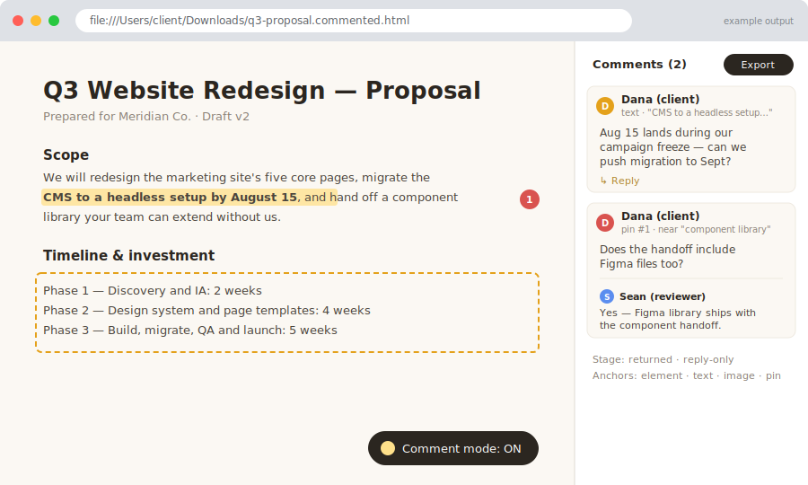

# client-review

> Part of the [`engineering-toolkit`](../../README.md) plugin — auto-invoked when you want a client to comment on a generated document


**Your client double-clicks a file, leaves comments like they would on a Google Doc, and you get their feedback back as markdown your agents can read — no account, no server, nothing to set up on their end.**



*Illustrative mockup of the commentable artifact a client receives.*

## What

Turns any HTML document you generate (report, plan, proposal) into a **single self-contained file a non-technical client can review offline** — double-click to open, comment, export, email back. No server, no account, no install, nothing phones home. Then converts their returned file into markdown your agents can read.

The round trip:

1. **Build** — `inject.mjs` adds the annotation layer to any HTML doc (idempotent; safe to re-run).
2. **Send** — one file, inline CSS/JS, comments data embedded. Share as-is.
3. **Client comments** — a comment-mode toggle with two capture modes: **highlight** (click a block or select a text range) and **free pin** (drop a pin anywhere; it anchors element-relative so it survives reflow). A right-side rail lists everything. Export bakes the comments in and stamps the file `returned`.
4. **You reply** — the returned file opens reply-only: you can respond to each comment but can't edit or delete the client's. Its export button turns into **Export markdown**.
5. **Agents read** — `read.mjs <returned.html>` prints every comment as anchored, authored, timestamped markdown to stdout — pipe it straight into the next agent's context.

## Why

Client feedback usually arrives as an email thread describing locations by prose ("the paragraph about pricing, third sentence") or as comments locked inside a Google Doc that agents can't cleanly consume. This gives clients the commenting UX they expect — on *your* generated artifact, with zero setup on their side — while every comment lands in one structured JSON blob (`client-review/1` schema) with a precise anchor (element, text range, image coordinates, or pin). `read.mjs` parses only that blob, never the rendered DOM, so it's robust to whatever the client's browser did to the page. The stage flag on the file makes the round trip automatic: the same file is client-editable going out and reply-only coming back.

## How

```bash
# inject the annotation layer into any HTML doc
node ${CLAUDE_PLUGIN_ROOT}/skills/client-review/inject.mjs proposal.html
# → proposal.commented.html  (send this file to the client)

# when it comes back, read the comments as markdown
node ${CLAUDE_PLUGIN_ROOT}/skills/client-review/read.mjs proposal.returned.html
```

Authoring from scratch? Start from `template.html` (plain, uninjected, warm editorial style), edit the content, then run `inject.mjs` as the last step. Two limits to respect: don't edit a returned file's document body (re-author and re-inject instead), and if the client returns multiple versions, the latest one wins — don't merge comment sets.
