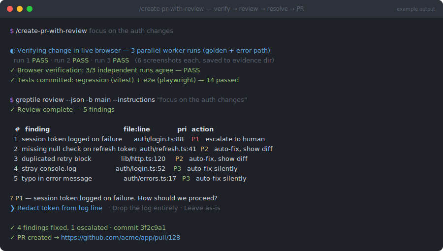

# create-pr-with-review

> `/engineering-toolkit:create-pr-with-review` — part of the [`engineering-toolkit`](../../README.md) plugin



*Illustrative mockup of a typical run — your findings, paths, and URLs will differ.*

## What

Ships your current branch as a pull request that has **already been through a review** — and, for anything user-visible, already been **proven to work in a real browser**. The order is fixed and non-negotiable:

**verify → review → resolve → create PR**

1. **Verify** — for any user-visible change, cheap worker sub-agents (Sonnet/Haiku tier) drive the live app with Playwright in 2–3 independent parallel runs, screenshotting every key step. PASS only if all runs agree.
2. **Lock in** — a hermetic regression test plus an e2e Playwright spec get committed alongside the change so it can't silently regress.
3. **Review** — the [Greptile CLI](https://www.greptile.com/) reviews the branch diff (`greptile review --json`) *before* any PR exists.
4. **Resolve** — every finding is triaged P1/P2/P3: P1 (security, payments, migrations, breaking changes, ambiguity) escalates to you; P2 is auto-fixed then shown as a diff; P3 (typos, lint, stray logs) is auto-fixed silently.
5. **Create** — the PR body is built with the [`pr-format`](../pr-format/README.md) structure, you confirm the final title + body, and the PR goes up.

## Why

Reviewers waste their first pass on things a machine catches: null checks, duplicated blocks, stray logs. Running the AI review **before** the PR exists means humans only ever see a second-draft diff — their attention goes to design and risk, not lint. And "it works" claims are backed by screenshots from multiple independent browser runs plus committed tests, not a promise. The P1 escalation rule keeps the speed without the recklessness: anything touching auth, money, data, or architecture stops and asks.

## How

Prerequisites: `greptile` CLI (signed in via `greptile login`), `gh` (authed), a GitHub remote, committed work on a non-default branch.

```
/engineering-toolkit:create-pr-with-review
/engineering-toolkit:create-pr-with-review focus on the auth changes
```

Arguments are optional — they're passed to Greptile as review `--instructions` and can also name a base branch. You'll be prompted at exactly two points: any P1 findings (pick a resolution per finding) and the final go-ahead before `gh pr create` runs. Everything else is autonomous.

Related: use [`resolve-comments`](../resolve-comments/README.md) for a PR that's already open, or [`pr-format`](../pr-format/README.md) to write a PR body without the review pass.
