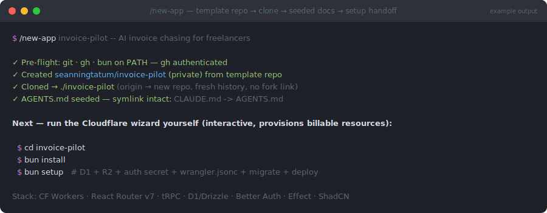

# new-app

> `/engineering-toolkit:new-app` — part of the [`engineering-toolkit`](../../README.md) plugin



*Illustrative mockup of a typical run — your app name and repo will differ.*

## What

Scaffolds a brand-new SaaS application from the [`cf-saas-starter-react-router`](https://github.com/SeanningTatum/cf-saas-starter-react-router) template:

1. **Creates a new GitHub repo from the template** (`gh repo create --template`) — fresh single-commit history, its own repo, no fork link — and clones it with `origin` already wired.
2. **Seeds the app's context docs** — rewrites the `AGENTS.md` overview with your app's name and description while keeping the `.brain/` harness pointers intact (`CLAUDE.md` stays a symlink to `AGENTS.md`).
3. **Hands off `bun setup`** — the interactive Cloudflare wizard that provisions D1, R2, auth secrets, and deploys. You run it yourself because it creates billable resources on your account.

Template stack: Cloudflare Workers · React Router v7 · tRPC · D1/Drizzle · Better Auth · Effect TS · ShadCN/Tailwind, with a `.brain/` agent harness.

## Why

"New project" friction is real: clone, detach from the template's history, rewire remotes, scrub the starter's docs so agents don't think they're working on the starter, then walk the cloud setup. GitHub's template feature plus this skill collapses that to one command with the right defaults (private visibility unless you say otherwise, kebab-case name sanitization, never clobbering an existing directory). The one thing it deliberately does *not* automate is `bun setup` — provisioning live Cloudflare resources is your decision to make interactively, not an agent side effect.

## How

Prerequisites: `git`, `gh` (authed), and `bun` on PATH.

```
/engineering-toolkit:new-app invoice-pilot -- AI invoice chasing for freelancers
/engineering-toolkit:new-app              # prompts for name / description / visibility
```

The name becomes the repo, directory, and Cloudflare project name. Nothing is committed or pushed beyond the template's initial commit — `bun setup` writes `wrangler.jsonc` and `.env`, so the first real commit is yours to make after the wizard finishes.
