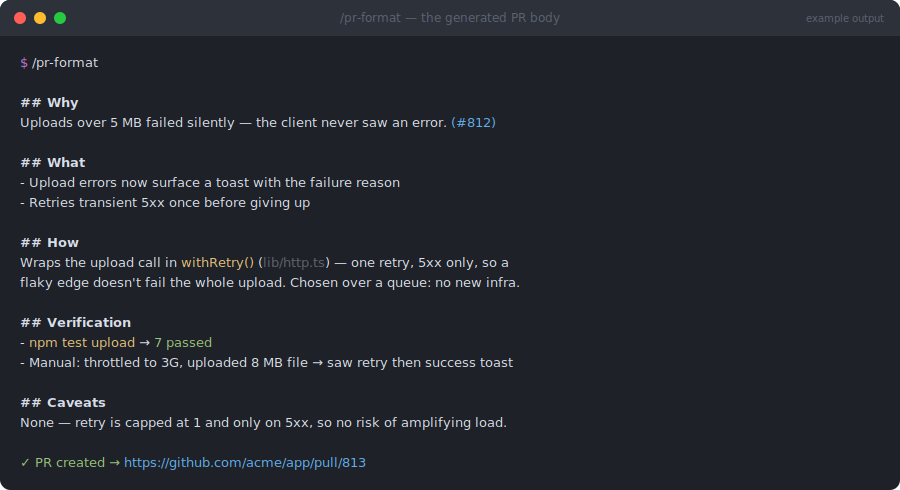

# pr-format

> `/engineering-toolkit:pr-format` — part of the [`engineering-toolkit`](../../README.md) plugin


**A reviewer should never have to open your diff just to figure out why a PR exists.**



*Illustrative mockup of a generated PR body — content is derived from your actual diff.*

## What

Writes a pull request description a reviewer can read top-to-bottom and fully understand — *why* the change exists, *what* it does, *how* it works, and *that it was verified* — without opening the diff. Always the same seven sections, always in this order, with anything that doesn't apply dropped rather than padded:

| Section | Answers |
| --- | --- |
| **Why** | What was broken/missing and who it hurt (mandatory, always first) |
| **What** | The observable change — a PM should be able to follow it |
| **How** | The mechanism and the key decisions, not a diff narration |
| **Solution** | Why this is the *right* fix, not just *a* fix |
| **Verification** | Tests run, manual steps, screenshots, numbers — concrete proof |
| **Caveats** | Honest risk surface: limitations, flags, rollback |
| **Next steps** | Deliberately deferred work, with tickets |

It derives What/How from the actual diff and commits, runs the repo's test command to fill Verification, and can create the PR itself via `gh pr create` (after showing you the final title + body).

## Why

Most PR descriptions are either empty or an auto-generated commit list — so reviewers reconstruct intent from the diff, which is the slowest possible way to review. A fixed structure means the reviewer always knows where to look; the "Why comes first" and "Verification is not optional for behavior changes" rules mean the two things reviewers actually need are never missing. Prose density scales with the change: a one-line fix gets a tight three-section body, a feature gets all seven — no ceremony-filling.

## How

```
/engineering-toolkit:pr-format
```

Works in two modes: output a ready-to-paste markdown body, or run the full `gh` flow (preflight auth check, branch off default if needed, push, confirm, create). Screenshots for UI changes are required by the rules — `gh` can't upload images, so it stages the body and tells you where to drag them in.

Related: [`create-pr-with-review`](../create-pr-with-review/README.md) uses this same structure for its final PR body.
