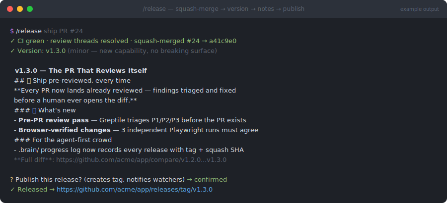

# release

> `/engineering-toolkit:release` — part of the [`engineering-toolkit`](../../README.md) plugin



*Illustrative mockup of a typical run — your version, notes, and URLs will differ.*

## What

Takes a green, merge-ready PR to a published, branded GitHub release in one fixed sequence:

**merge → version → notes → release**

1. **Squash-merge** the PR (`gh pr merge --squash --delete-branch`) — the squash commit becomes the source of truth for the notes.
2. **Pick the next semver tag** from git tags alone (no package.json version to bump): minor for new capability, patch for fixes-only, major for breaking changes — judged by *content*, not diff size.
3. **Write marketing-grade notes** in the repo's established voice: a hook title that makes a claim ("Every PR Gets Its Own SaaS", never "Preview deployment support"), a bold outcome-selling opener, emoji-bulleted sections where every bold claim is followed by the concrete mechanics, a closing "For the agent-first crowd" section, and the full compare link.
4. **Publish** with `gh release create` — after showing you the final title and rendered notes for an explicit go-ahead, because a release fires webhooks and is hard to retract.

## Why

Releases named after their category are changelogs; nobody reads changelogs. Notes written *before* the merge describe intentions, not what landed. This skill enforces both lessons structurally: notes are only drafted against the actual squash commit, every marketing claim must trace to something real in the diff, and the hook title is mandatory. It also closes the loop the way an agent-first repo needs — appending the release to `.brain/CHANGELOG.md` and the progress log — and never deploys as a side effect, because "release" and "deploy to production" are different decisions.

## How

Prerequisites: `gh` authed, the PR's CI checks green, review threads resolved, clean working tree.

```
/engineering-toolkit:release ship PR #24
/engineering-toolkit:release              # infers the PR when unambiguous
```

You're prompted once: the explicit go-ahead before `gh release create` runs. The final report gives the squash SHA, tag, and release URL.
