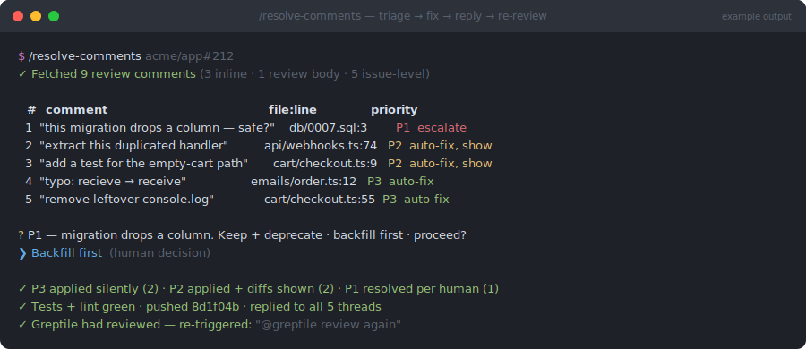

# resolve-comments

> `/engineering-toolkit:resolve-comments` — part of the [`engineering-toolkit`](../../README.md) plugin



*Illustrative mockup of a typical run — your comments, paths, and URLs will differ.*

## What

Reads every review comment on a GitHub PR — inline threads, review summaries, and general issue-level comments — and resolves the ones an agent can safely act on, escalating the rest. Each actionable comment is triaged into exactly one priority:

- **P1 — human in the loop.** Security/auth/secrets, payments, data migrations, breaking API changes, architecture disagreements, ambiguous or conflicting feedback, reviewer questions. Never auto-applied; you're presented options and decide.
- **P2 — auto-fix, then show.** Clear, bounded, single-concern fixes (the null check the reviewer pinpointed, the test they asked for). Applied, then the batched diff is shown before pushing.
- **P3 — auto-fix silently.** Typos, formatting, import order, stray `console.log`s. Just done.

After fixing, it replies to every touched thread on GitHub with what changed, pushes, and — if Greptile had reviewed the PR — posts `@greptile review again` to trigger a fresh pass.

## Why

Review feedback is bimodal: most comments are mechanical ("typo", "remove this log", "add the null check") and a few are genuinely consequential ("is this migration safe?"). Handling them all manually wastes your time on the former; letting an agent handle them all risks the latter. The P1/P2/P3 ruleset — with a hard **when in doubt, escalate up** rule — gets velocity on the 80% while guaranteeing a human decides anything that touches money, data, or design. The triage table prints *before* any edit, so you always see the plan first.

## How

Prerequisites: `gh` CLI authed, PR exists with review comments.

```
/engineering-toolkit:resolve-comments                 # PR for the current branch
/engineering-toolkit:resolve-comments acme/app#212    # or a URL, or a bare number
```

Flow: fetch all comments → print triage table → escalate P1s and wait for your call → apply P3s silently, P2s with diffs shown → commit, push, reply to threads → re-trigger Greptile if it had reviewed. The final summary reports counts per priority, the pushed SHA, and whether a re-review was requested.

Related: [`create-pr-with-review`](../create-pr-with-review/README.md) runs the same ruleset *before* the PR exists; [`pr-format`](../pr-format/README.md) writes the PR body.
