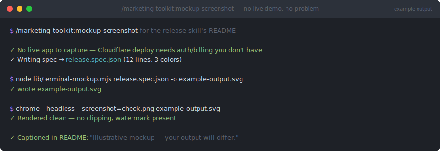

# mockup-screenshot

> `/marketing-toolkit:mockup-screenshot` — part of the [`marketing-toolkit`](../../README.md) plugin


**"No live demo" stops being an excuse for a README with no visual — generate a labeled, honest mockup instead.**



*Illustrative mockup of a typical run — your spec and output will differ.*

## What

Generates a labeled, obviously-illustrative "example output" image for a doc when there's no real screenshot to capture — a CLI tool with no live demo environment, a feature that needs cloud auth/billing you don't have in-session, or a skill that only produces output mid-workflow. Two modes:

- **Terminal transcript** (the default, parameterized) — feed a JSON spec (title + colored lines) to `lib/terminal-mockup.mjs`, get a macOS-terminal-styled SVG back.
- **Browser window** (freehand) — copy `lib/browser-mockup-template.svg`, keep the chrome, draw the actual page content by hand.

Every output carries an "example output" watermark baked into the chrome, and the calling doc is expected to caption it as illustrative — so nobody mistakes a mockup for a real capture.

## Why

A README with no visual reads as unfinished or unverified, but plenty of real skills genuinely have nothing capturable — they run inside a chat session, need billing to provision resources, or produce output only as part of a larger workflow. The honest answer isn't "skip the visual" or "pretend it's a real screenshot" — it's a clearly-labeled mockup that still shows the shape of the output (a triage table, a pass/fail sequence, a generated PR body) so a reader gets the same "oh, that's what this looks like" moment a screenshot gives. Parameterizing the terminal case means writing a new mockup is "write a JSON spec," not "hand-draw SVG and eyeball the pixel math" — which is how the first six `engineering-toolkit` READMEs got their mockups, extracted into a reusable tool here.

## How

```bash
node ${CLAUDE_PLUGIN_ROOT}/skills/mockup-screenshot/lib/terminal-mockup.mjs <spec.json> -o example-output.svg
```

See `examples/sample.spec.json` for the spec format (title, width, colored/bold line spans). For a browser mockup, copy `lib/browser-mockup-template.svg` and edit the content region directly.

Always render before treating it as done — headless Chrome is the fastest check:

```bash
"/Applications/Google Chrome.app/Contents/MacOS/Google Chrome" \
  --headless --disable-gpu --screenshot=check.png --window-size=<w>,<h> \
  "file:///absolute/path/to/example-output.svg"
```

**Prefer a real screenshot whenever one is obtainable** — this skill is the fallback, not the default.
