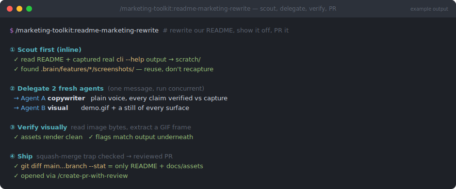

# readme-marketing-rewrite

> `/marketing-toolkit:readme-marketing-rewrite` — part of the [`marketing-toolkit`](../../README.md) plugin


**Your README is the landing page most people judge the project by — this rewrites it in plain, marketing-grade language and backs every claim with a real screenshot of the thing actually running, then ships it as a reviewed PR.**



*Illustrative mockup of a typical run — your repo, surfaces, and output will differ.*

## What

A coordinator playbook for turning a dry, out-of-date, or terminal-only README into a page that *sells* the project — honestly. It runs as a fixed sequence: scout the real product yourself, fan out two independent agents (one for copy, one for visuals), verify the assets by actually looking at them, then open a reviewed PR.

The load-bearing moves:

- **Scout first, delegate second** — capture real `--help`/API output and reuse the project's *existing* feature-verification screenshots before spawning anything. Agents invent plausible flags and numbers when starved of real data.
- **Two fresh agents in one message** — a copywriter (given a strict concrete-over-hyped voice brief) and a visual-capture agent (demo GIF + a still of *every* surface, not just the terminal) run concurrently, no shared state.
- **Verify visually** — read the image bytes and extract a GIF frame before trusting any "done" report; spot-check every documented flag against the step-1 capture underneath it.
- **Ship safely** — check the squash-merge diff trap, watch for concurrent sessions on a shared checkout, stage files by name, and PR through a review-first flow.

## Why

Most READMEs are written once and rot: they describe the tool at v0.1, show a single terminal snippet, and never prove any of it still works. Meanwhile the README is the *first and often only* thing a prospective user reads before deciding whether to install. The gap between "the product is good" and "the README makes that legible" is where installs are lost.

Two failure modes usually fill that gap, and this playbook is built to avoid both. One is hype — "blazingly fast", "revolutionary", "seamless" — adjectives that a skeptical reader discounts on sight. The other is fabrication — an agent, told to "make it pop", cheerfully invents flags, benchmarks, and screenshots that don't match reality. The fix for both is the same discipline: **every factual claim traces to something you actually captured**, and every visual is a real screenshot of the running product (or, where nothing is capturable, a labeled mockup via [`mockup-screenshot`](../mockup-screenshot/README.md) — never a fake passing as real). Plain language sells better than jargon *and* is easier to keep honest.

## How

Invoke it in the target repo:

```
/marketing-toolkit:readme-marketing-rewrite
```

or just ask — "rewrite our README for marketing", "make our README pop", "show off the features with real screenshots" — and it auto-invokes.

It then walks the playbook in order. You stay in the loop at the decision points it's designed to surface: a concurrent session on the checkout, a review-backend outage (it gives you the correlation IDs and asks before skipping the pre-PR pass), or a publish/install-model choice. What you'll be prompted for is the same handful of "this is genuinely yours to decide" moments — everything mechanical (capturing output, drafting copy, generating visuals, staging by name) it does itself.

**Prerequisites it looks for and adapts to:**

- Terminal-recording tooling (`vhs`, `freeze`, `agg`, `asciinema`) for the demo GIF — falls back to rendering the demo with the [`hyperframes`](https://claude.com/claude-code) skill (deterministic, no capture step) if none is installed.
- A live browser UI → captures it via `claude-in-chrome` or headless Chrome.
- A review-first PR skill like [`create-pr-with-review`](../../../engineering-toolkit/skills/create-pr-with-review/README.md) — used for the final step so the README lands as a reviewed second draft, not a first one.

### Related skills

- [`mockup-screenshot`](../mockup-screenshot/README.md) — the honest fallback when a surface genuinely has no capturable live demo.
- [`create-pr-with-review`](../../../engineering-toolkit/skills/create-pr-with-review/README.md) — the review → resolve → PR flow this playbook hands off to at step 7.
- [`pr-format`](../../../engineering-toolkit/skills/pr-format/README.md) — structures the PR body it opens.
